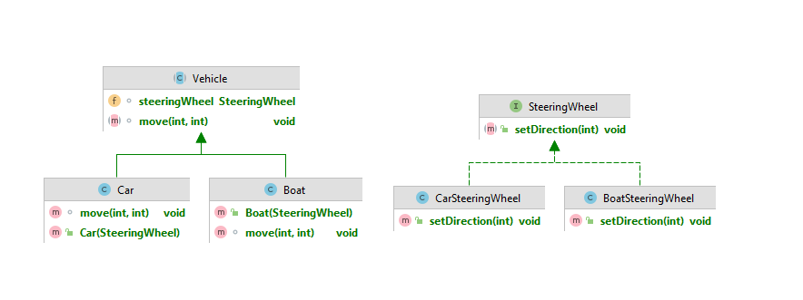
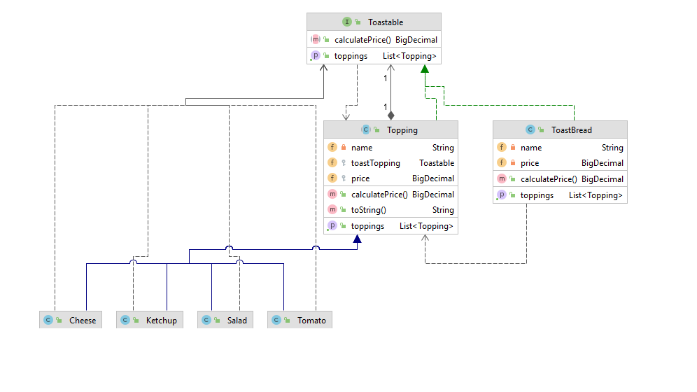

# Design Patterns Examples
This repository consists of small applications that I applied while learning design patterns.
## 1. Creational Patterns
## 2. Structural Patterns

### Bridge

------------
## Vehicle 

Reference:
`https://www.youtube.com/watch?v=e-h4VRmSGUQ&list=PLCp1YoRkzkpbgstE-aF1nV5m9r4KXs4zn&index=2`

### Decorator

------------

## Coffee Shop
   Reference:
   `https://www.youtube.com/watch?v=e-h4VRmSGUQ&list=PLCp1YoRkzkpbgstE-aF1nV5m9r4KXs4zn&index=2`

## Phone
Reference:
`https://www.youtube.com/watch?v=Op97BRovYtA`

## Toast

Reference:
`https://www.udemy.com/share/104gtw3@csepCBOV1933CjrHbKE3dSJw1jc37TY2AAKiPwaQ-RdnuaE2IsxUYYVKSeO7Qhc8/`
